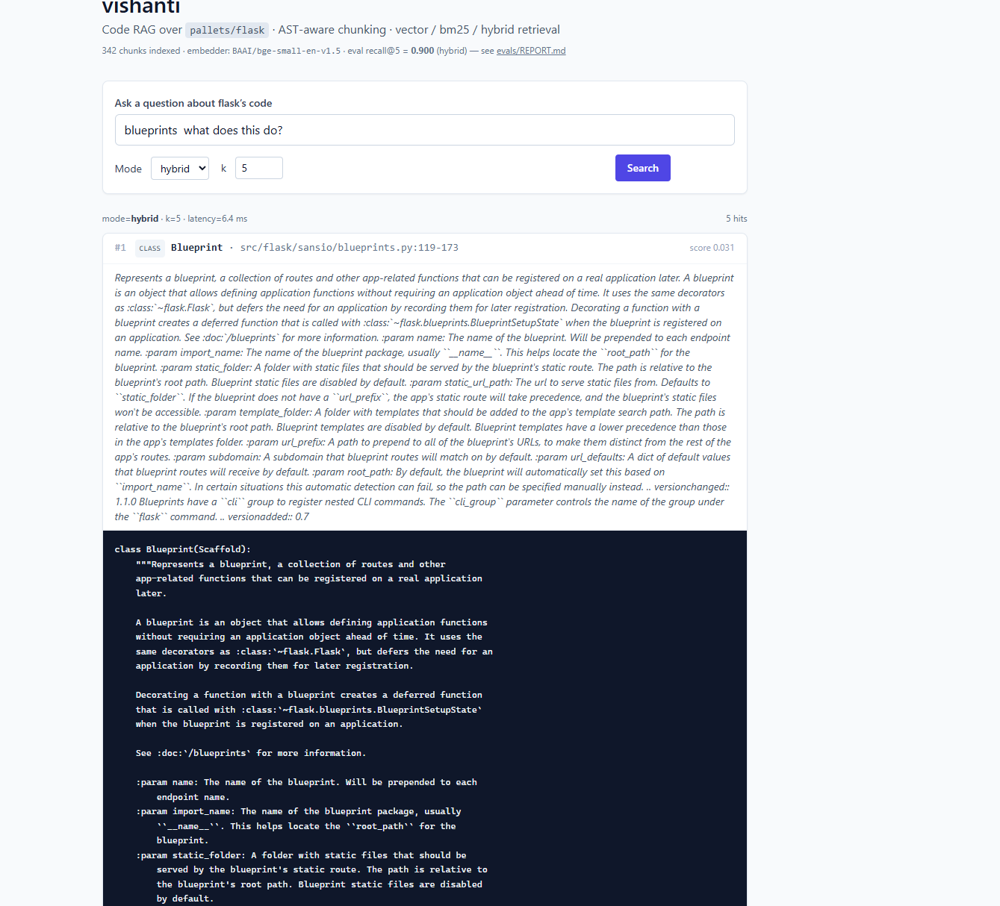

# code-rag

Code RAG over [`pallets/flask`](https://github.com/pallets/flask) with AST-aware chunking, hybrid retrieval, and a measured eval harness.

**Headline:** **recall@5 = 0.900** (hybrid) on a 30-question hand-curated eval set, with a full 3-way ablation against vector-only and BM25-only baselines. Sub-10ms retrieval over 342 AST chunks.

> See [`evals/REPORT.md`](evals/REPORT.md) for the headline run and [`evals/ABLATION.md`](evals/ABLATION.md) for the full vector / bm25 / hybrid comparison.

---

## Eval results

3-way ablation across the same 30 questions, same chunks, same `k=5`:

| Mode       | overall   | where_defined | how_works | what_calls | latency p50 |
|------------|-----------|---------------|-----------|------------|-------------|
| vector     | 0.867     | 1.000         | 0.900     | 0.700      | 0.04 ms     |
| bm25       | 0.667     | 0.500         | 0.800     | 0.700      | 1.21 ms     |
| **hybrid** | **0.900** | **0.900**     | **1.000** | **0.800**  | 0.88 ms     |

Hybrid (vector + BM25 fused via reciprocal rank fusion, c=60) wins overall and never loses a category by more than one question. Vector dominates on natural-language queries (`"how does Flask handle WSGI requests"`); BM25 catches symbol-name queries vector misses (`"what calls register_blueprint"`); hybrid covers both modes.

---

## Why this works (and most code-RAG demos don't)

Three deliberate choices, each measured:

1. **AST-aware chunking, not character chunking.** [`src/code_rag/chunker_ast.py`](src/code_rag/chunker_ast.py) parses every `.py` file with [tree-sitter-python](https://github.com/tree-sitter/tree-sitter-python) and emits one chunk per top-level function or class — with the docstring, decorators, and full body intact. Oversized classes (>100 lines) split into a class-header chunk plus one chunk per method, with `parent_class` metadata preserved. A separate "module preamble" chunk captures top-level imports and `LocalProxy` definitions like `flask.globals.current_app` that pure-symbol chunkers miss.

2. **Hybrid retrieval with code-aware tokenization.** [`src/code_rag/retriever.py`](src/code_rag/retriever.py) runs BM25+ alongside cosine vector search. The BM25 tokenizer splits `camelCase` and `snake_case` so `register_blueprint` matches `RegisterBlueprint` matches `register blueprint`. Reciprocal Rank Fusion (RRF) blends the two ranked lists — c=60, fetch_k=20 per retriever, taken from the original RRF paper.

3. **A real eval set, not vibes.** [`evals/dataset.json`](evals/dataset.json) is 30 hand-curated questions across three categories — `where_defined`, `how_works`, `what_calls` — with ground-truth file paths and line ranges for each. A retrieval is a "hit" if any returned chunk's line range overlaps any ground-truth span. [`src/code_rag/evals/run.py`](src/code_rag/evals/run.py) runs all three retrievers against all 30 questions in <2s and writes [`REPORT.md`](evals/REPORT.md) + [`ABLATION.md`](evals/ABLATION.md).

The chunker is the load-bearing piece. An earlier iteration used naive whole-class chunking and topped out at recall@5 = 0.700. Adding the module-preamble chunk and class-header split (without changing retrieval) lifted hybrid to 0.900 — diagnosed via the per-question table in `ABLATION.md`, not by tuning hyperparameters.

---

## The UI

FastAPI + Jinja2 + HTMX + Tailwind. One process, one deploy, no JavaScript framework.



- `GET /` — search box, mode dropdown (vector / bm25 / hybrid), k slider.
- `POST /search` — returns an HTML fragment with the top-k chunks: file path, line range, score, docstring, syntax-highlighted code.
- `GET /healthz` — pipeline-warm probe for deploy health checks.

The pipeline ([`src/code_rag/pipeline.py`](src/code_rag/pipeline.py)) is built once at startup and cached to disk at `data/cache/index.npz`. Cold boot (chunk + embed all 342 chunks) is ~50s; warm boot is instant. Cache key is a hash of source-file size + mtime + model name, so a `git pull` of new flask code invalidates the cache automatically.

---

## Quickstart

```bash
git clone https://github.com/chintan-diwakar/code-rag.git
cd code-rag
python -m venv .venv
.venv/Scripts/activate                  # Windows
# source .venv/bin/activate              # Unix
pip install -e ".[dev]"

# One-time: clone the corpus we index
git clone --depth 1 https://github.com/pallets/flask.git data/flask

# Run the tests (63 of them, ~2s)
pytest

# Run the UI
python -m uvicorn code_rag.app:app --reload
# open http://127.0.0.1:8000
```

## Reproduce the evals

```bash
python -m code_rag.evals.run
# writes evals/REPORT.md and evals/ABLATION.md
```

Output:

```
Step 1: chunking flask source...
  342 chunks in 0.34s
Step 2: loading embedder (BAAI/bge-small-en-v1.5)...
  embedder ready (dim=384) in 1.82s
Step 3: embedding 342 chunks...
  done in 12.41s
Step 4: building retrievers...
Step 5: loading eval set + embedding questions...
  30 questions

Step 6: running retrieval for each mode...
  vector    recall@5=0.867   p50=0.04ms   p95=0.06ms
  bm25      recall@5=0.667   p50=1.21ms   p95=1.76ms
  hybrid    recall@5=0.900   p50=0.88ms   p95=1.54ms
```

---

## Repo layout

```
src/code_rag/
  chunker_ast.py        AST-aware chunker (tree-sitter-python)
  embedder.py           fastembed wrapper (BAAI/bge-small-en-v1.5)
  retriever.py          VectorRetriever, BM25Retriever, HybridRetriever (RRF)
  pipeline.py           Singleton with disk-cached embeddings
  app.py                FastAPI + lifespan + routes
  templates/            Jinja2 + HTMX
  evals/
    types.py            EvalQuestion, GroundTruthSpan
    run.py              The eval runner -> REPORT.md + ABLATION.md
    verify.py           Dataset structural sanity-check

evals/
  dataset.json          30 hand-curated questions
  REPORT.md             Headline run (hybrid mode)
  ABLATION.md           3-way diff with per-question table

tests/                  63 tests across chunker, embedder, retriever,
                        evals, pipeline, app
```

## Stack

- **Chunker:** [tree-sitter-python](https://github.com/tree-sitter/tree-sitter-python)
- **Embeddings:** [fastembed](https://github.com/qdrant/fastembed) running [`BAAI/bge-small-en-v1.5`](https://huggingface.co/BAAI/bge-small-en-v1.5) (384d, ONNX runtime — no PyTorch dep)
- **Retrieval:** in-memory cosine + custom BM25+ + Reciprocal Rank Fusion
- **Web:** FastAPI + Jinja2 + HTMX + Tailwind via CDN
- **Tests:** pytest

No LangChain, no LlamaIndex, no vector DB service. The whole pipeline is in
~600 lines of Python.

## License

MIT
